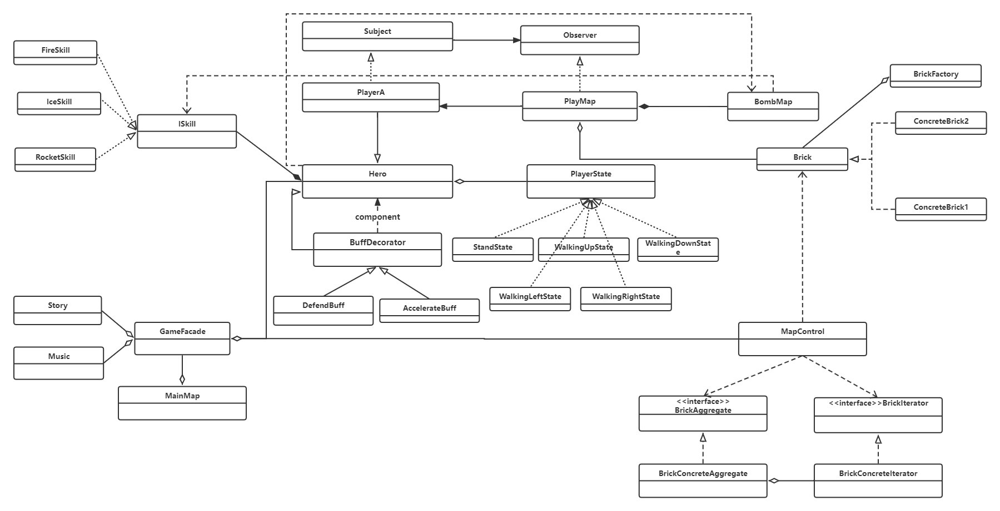
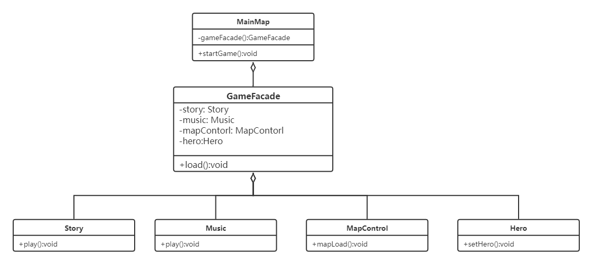
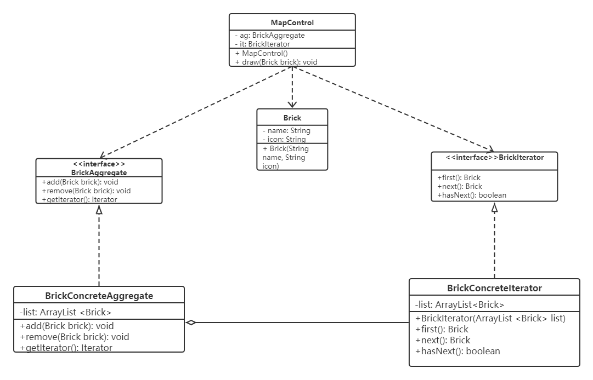

<div align='center' ><font size='6'>炸弹人游戏的分析与设计</font></div>

<div align='center' ><font size='2'>孟宪彪 MF21320114</font></div>
<div align='center' ><font size='2'>陈贤鹏 MF21320022</font></div>
<div align='center' ><font size='2'>秦皓宇 MF21320120</font></div>
<div align='center' ><font size='2'>王广周 MF21320141</font></div>
<div align='center' ><font size='2'>王尚 MF21320145</font></div>


# 需求分析

## 游戏背景

&emsp;&emsp;《炸弹人》系列游戏最发行生于1983年，是日本电视游戏厂商HUDSON出品的一款ACT类型游戏，经典的第一作登陆在FC版本。游戏具体操作是一个机器人放置炸弹来炸死敌人，但也可以炸死自己，还有些增强威力与技能道具增加了游戏的可玩性。

&emsp;&emsp;该系列自1983年以来在全球快速吸引了大批玩家的参与，并且随着时代技术的发展，新的玩法，新的版本都源源不断地给《炸弹人》系列游戏和以炸弹人为模板的游戏吸引着大量的粉丝，几乎每一个90后的年轻人，在儿时或多或少都曾经接触过类似《泡泡堂》、《Q版泡泡堂》等《炸弹人》类型的游戏。

## 玩法介绍

&emsp;&emsp;炸弹人的玩法较为简单，整体上来说，都是玩家操作游戏角色，在地图上释放炸弹，炸弹被释放后，延迟一定时间爆炸，并对炸弹附近的敌我双方单位或建筑物造成伤害，游戏角色释放炸弹后也需要尝试使用障碍物来躲避炸弹（《炸弹人》游戏通常来说炸弹是无差别攻击），并且游戏通常会增加道具，以给玩家捡取使用，玩家捡取的道具功能通常包括：提升炸弹威力、获取保护罩、提高血量上限、加快角色速度、更改炸弹类型等等，道具的加入大大增加了玩家游戏体验及游戏的可玩性。

&emsp;&emsp;最初，于1983年开始发行的一系列《炸弹人》游戏，由于是单机运行的像素风游戏，所以此阶段《炸弹人》游戏主要以闯关冒险为卖点，通过玩家操控游戏角色在各个关卡进行闯关为主，其中玩家需要在游戏过程中不断利用炸弹击杀怪物、躲避怪物攻击并捡取道具，随着网络技术的发展，《炸弹人》系列游戏与几乎所有早期投入到互联网的游戏一样，迅速进行了改型，并投入到网络游戏的行列中，这类游戏的佼佼者便有韩国游戏公司Nexon开发的一款休闲游戏（Casual Game）《泡泡堂》，游戏中不仅具有过去《炸弹人》系列游戏的闯关冒险，也加入了玩家与玩家之间的战斗，其中玩家之间的竞争模式迅速收获了大量玩家好评。竞争模式常为多个玩家进入游戏相互战斗，以获取最多积分或存活到游戏结束为胜利，玩家通过炸弹摧毁墙砖，获取道具，同通过炸弹攻击其他玩家，大大提高了游戏的娱乐性。

## 功能概述

&emsp;&emsp;我们的游戏以网络版多玩家战斗的联机《炸弹人》游戏为基础进行设计，玩家进入游戏前进行段位匹配，将游戏水平相近的玩家匹配起来进行游戏以增强大多数玩家的游戏体验，避免游戏水平差距过大的玩家进行匹配；玩家进入游戏后，游戏地图初始化，生成障碍物和墙壁，其中部分的障碍物内存在道具，玩家摧毁该障碍物后将掉落道具；玩家初始状态为短暂的无敌时间，并将玩家之间尽可能远地生成在地图上，同时保证玩家之间存在障碍物，不存在玩家之间之间通路的路径；玩家进入游戏后，释放炸弹炸毁障碍物，一方面进行道具的搜索，另一方面将玩家之间的道路打通，以便于后续玩家交战；玩家炸毁障碍物后，一定概率会掉落道具，其中道具将会从各方位提升玩家角色的属性，或更改玩家攻击方式，包括火、冰、火箭等等，道具的使用，将在最终玩家交战时，造成玩家角色属性的差异性，大大提高了玩家的游戏体验，避免完全相同能力的角色进行战斗，使休闲游戏过于硬核，同时使用各种类型后的玩家之间相互克制，大大提高了游戏的可玩性；玩家相遇后通过道具或炸弹相互战斗，玩家角色出现在道具或炸弹的攻击范围内时，将会扣除玩家角色的血量，当玩家角色血量降至0后，玩家的游戏角色将被移除出地图，进行游戏的旁观或退出游戏，留在场地上的玩家继续进行战斗，最后留下的玩家或玩家小队，或游戏时限内获得积分最高的玩家或玩家小队将会获得游戏的最终胜利。

# 概要设计

## 类的总体设计

<center></img></center>
<center>图x</center>

&emsp;&emsp;类的总体设计体现了所涉及的部分核心接口以及类，反映了设计模式：策略模式、状态模式、责任链模式、抽象工厂模式、装饰者模式、观察者模式、单例模式、享元模式、迭代器模式、外观模式。

## 设计决策与分析

&emsp;&emsp;在用户游戏的最开始，玩家需要点击开始游戏开始游戏，此时需要完成许多功能，例如播放故事背景、播放背景音乐、加载地图等。这些每个模块都是一个子系统，也不可能让用户去调用一个个模块，这样随着系统的变化，客户端也要跟着改变，这违背了“开闭原则”，也违背了“迪米特法则”。采用**外观模式**为多个子系统提供一个统一的接口，从而降低系统的耦合度。它减少了客户处理的对象数目，使得子系统使用起来更加容易。

&emsp;&emsp;段位系统是很多游戏常见的子系统，用户只有在和水平相当的用户一起游戏才有可能有良好的游戏体验。在很多情况下，可以处理某个请求的对象不止一个。很多对象都可以处理申请，而且它们构成一条链，请求沿着这条链传递，这条链就称为责任链。在本游戏实例中，使用了**责任链模式**。玩家等级星的数量先从青铜类评定，评定过了会传递给后面责任链，直到被处理。这样做可以使用户无须关心请求的处理细节以及请求的传递，只需将请求发送到链上即可。

&emsp;&emsp;在游戏设计中，应该让熟练的玩家玩更困难的内容，新手玩家玩更容易上手的游戏内容。因此，高级别难度下生产的产品建筑和道具功能复杂，支持高段位等级的玩家挑战，低级别难度下生产的产品建筑和道具功能简单，支持低段位等级的玩家挑战。在用户设备上，针对高、中、低分辨率的移动设备使用不同的显示资源和帧率。使用**抽象工厂模式**，让每一个具体工厂生产多个具体产品，从而提供一个创建一系列相关或相互依赖对象的接口，而无需指定它们具体的类。

&emsp;&emsp;地图生成模块是一个较为复杂的模块，需要对地图区域、砖块、游戏人物进行生成。砖块作为炸弹人地图的主要组成之一，在游戏中起到道具获取，分割地图，躲避炸弹等至关重要的作用。在地图初始化时，将会产生大量的相似砖块对象，其中砖块的属性和功能往往是相似甚至于相同的，但是随着大量的砖块对象被创建出来，浪费了大量的内存，使得运行的代价过高，导致性能下降等种种问题。引入**享元模式**可以很好的解决这个问题，对性能进行优化。另外，大量砖块的生成可以使用**迭代器模式**，定义访问和遍历砖块聚合的接口，方便对所有的砖块进行各种操作。

&emsp;&emsp;物理攻击道具是玩家可以吃掉的增加或改变攻击方式的道具，目前包括火、冰、火箭。采用**策略模式**对攻击行为进行多种方式的实现，从而使得用户无需关注使用方式，只需要按下攻击键即可实现不同的攻击逻辑。方便后续引入更多攻击道具，易于扩展、理解和切换，同时具有更好的代码复用性，使用组合而不是继承让架构更加灵活。

&emsp;&emsp;控制人物行走是一个重要的模块，不同的行走状态下，用户使用不用的按钮需要对应不同的执行逻辑。采用**状态模式**将实现细节封装在各个不同的状态类中，状态转换交给状态类自己去实现，外部无需关心。去除了大量的判读逻辑，代码可读性更好了。也可以方便的实现状态的新增。

&emsp;&emsp;Buff加成类道具主要是值护盾、移速鞋等道具的实现。相比于攻击道具，这些道具主要改变的是用户的移动、防御等状态。这两种加成道具是可以动态的、可叠加的附加到玩家身上。因此可以使用**装饰者模式**，将玩家作为被装饰对象，加成道具作为装饰者，达到获取加成的目的。

&emsp;&emsp;在游戏中当玩家生命值降到0时即会死亡，这时玩家的在地图上的所有状态包括身影都将移除出地图。为了让玩家和地图之间进行交互但同时维持松耦合，可以采用**观察者模式**，玩家作为被观察的对象，当玩家死亡后通知作为观察者的地图，地图再做出相应的去除玩家操作。

# 详细设计

## 游戏开始界面模块

&emsp;&emsp;用户点击开始游戏，可采用外观模式封装多个系统接口，依次执行播放故事背景、播放背景音乐、加载地图和加载角色。
<center></img></center>
<center>图x</center>

主界面，玩家点击开始游戏后，开始加载各类资源

```java
public class MainMap {
    private GameFacade gameFacade;
    public void startGame(){
        // 调用各个类，加载各类资源
        gameFacade.load();
    }
}
```

外观GameFacade类，包括故事背景展示、背景音乐播放、加载地图、加载抉择接口，供主界面调用

```java
public class GameFacade{
    private Story story;
    private Music music;
    private MapControl mapControl;
    private Hero hero;
    public void load(){
        // 故事场景显示
        story.play();
        // 播放背景音乐
        music.play();
        // 加载地图
        mapContorl.loadMap();
        // 加载角色
        hero.setHero();
    }
}
```

场景故事类，叙述故事背景

```java
public class Story{
    public void play(){

    }
}
```

背景音乐类，播放背景应用

```java
public class Music{
    public void play(){
        
    }
}
```

地图控制类，加载地图

```java
public class MapContorl{
    public void loadMap(){
        
    }
}
```

角色类，加载角色

```java
public class Hero{
    public void setHero(){

    }
}
```

## 段位系统模块

&emsp;&emsp;炸弹人玩家段位等级设计，不同级别可以选择对应难度的关卡地图。
一共有3个段位，分别为青铜、白银、黄金。挑战模式中，每赢一局就能获得一颗星反之则失去一颗星。获得的星数与段位存在一种联系，当星数达到一定的程度，系统会匹配出相应的段位。玩家等级越高，可选择的关卡越多，同时难度也更大。不同级别难度下游戏地图可以产生不同类型的建筑及道具。

&emsp;&emsp;在很多情况下，可以处理某个请求的对象不止一个。很多对象都可以处理申请，而且它们构成一条链，请求沿着这条链传递，这条链就称为责任链。责任链可以是一条直线、一个环或者一个树形状，最常见的责任链是直线型，即沿着一条单向的链来传递请求。链上的每个对象都是请求处理者，责任链模式可以将请求的处理者组织成一条链，并使请求沿着链传递，由链上的处理者对请求进行相应的处理，客户端无须关心请求的处理细节以及请求的传递，只需将请求发送到链上即可。将请求的发送者和请求的处理者解耦，这就是责任链的模式动机在本游戏实例中，玩家等级星的数量先从青铜类评定，评定过了会传递给后面责任链，直到被处理。

&emsp;&emsp;职责链模式包含以下角色：

&emsp;&emsp;Handler(抽象处理者) 抽象处理者定义了一个处理请求的接口，它一般设计为抽象类，由于不同的具体处理者处理请求的方式不同，因此在其中定义了抽象请求处理方法。因为每个处理者的下家还是一个处理者，因此在抽象处理中定义了一个自类型(抽象处理者类型)的对象，作为其对下家的引用。通过该引用，处理者可以连为一条链。
Base Handler(基础处理者) 是一个可选的类，可以将所有处理者共用的样本代码放置在其中。通常情况下，该类中定义了一个保存对于下个处理者引用的成员变量。客户端可通过将处理者传递给上个处理者的构造函数或设定方法来创建链。该类还可以实现默认的处理行为：确定下个处理者存在后再将请求传递给它。

&emsp;&emsp;ConcreteHandler(具体处理类) 具体处理类是抽象处理类的子类，它可以处理用户请求，在具体处理者类中实现了抽象处理者中定义的抽象请求处理方法，在处理请求之前需要进行判断，看是否有对应的处理权限，如果可以处理请求就处理它，否则将请求转发给后继者；在具体处理类中可以访问链中下一个对象，以便请求转发。

&emsp;&emsp;Client(客户类) 客户类用于向链中的对象提出最初的请求，客户类只用关心链的源头，而无须关心请求的处理细节以及请求的传递过程。

&emsp;&emsp;在本例中，炸弹人三个段位：青铜，白银，黄金。星数量少于15，对应段位为青铜；星数量在15-35之间对应段位为白银；星数在35-55之间对应段位为黄金；多于55颗星，表示为黄金(X-55)星。

<center></img></center>
<center>图x</center>

**创建请求类(StarRatingRequest)**

```java
public class StarRatingRequest {
    private String playerName;
    private int starNumber;
    public StarRatingRequest(String _playerName, int _starNumber) {
        this.playerName = _playerName;
        this.starNumber = _starNumber;
    }
    public String getPlayerName() {
        return playerName;
    }
    public void setPlayerName(String playerName) {
        this.playerName = playerName;
    }
    public int getStarNumber() {
        return starNumber
    }
    public void setStarNumber(int starNumber) {
        this.starNumber = starNumber;
    }
}
```

**创建抽象处理者类(GameLevel)**

```java
public abstract class GameLevel {
    //定义自类型 
    protected GameLevel successor;
    //接收下一家对象 
    public void setSuccessor(GameLevel successor) {
    this.successor = successor;
    }
    //抽象处理方法 
    public abstract void handleRequest(StarRatingRequest request);
}
```

**创建具体处理者类(Bronze)**

```java
public class Bronze extends GameLevel {
    /*
    * 创建具体处理者类
    * 当客户端传入的星数少于15，由该对象处理，否则传递给客户端指定的下家
    */
    @Override
    public void handleRequest(StarRatingRequest request) {
        if(request.getStarNumber() < 15) {
            System.out.println("玩家[" + request.getPlayerName() + "]统计为" 
            + request.getStarNumber() + "颗星，评定为等级：青铜");
        }else {
        if(this.successor != null) {
            this.successor.handleRequest(request);
        }
        }
    }
}
```

**创建具体处理类(Silver)**

```java
//创建具体处理者类
//当客户端传入的星数在15-35，由该对象处理，否则传递给客户端指定的下家
public class Silver extends GameLevel {
    @Override
    public void handleRequest(StarRatingRequest request) {
  if(request.getStarNumber() < 35) {
   System.out.println("玩家[" + request.getPlayerName() 
   + "]统计为" + request.getStarNumber() + "颗星，评定为等级：白银");
  }else {
   if(this.successor != null) {
    this.successor.handleRequest(request);
   }
  }
 }
}

```

**创建具体处理类(Gold)**

```java
//创建具体处理者类
//当客户端传入的星数在35-55，由该对象处理，否则评定为王者段位
public class Royalty extends GameLevel {
 @Override
 public void handleRequest(StarRatingRequest request) {
  if(request.getStarNumber() < 55) {
   System.out.println("玩家[" + request.getPlayerName() + "统计为" 
     + request.getStarNumber() + "颗星，评定为等级：黄金");
  }else {
   System.out.println("玩家[" + request.getPlayerName() 
   + "]统计为" + request.getStarNumber() 
   + "颗星，评定为等级：黄金" + (request.getStarNumber()-55) + "星");
  }
 }
}
```

## 炸弹地图模块

&emsp;&emsp;作为游戏的唯一攻击方式，炸弹在地图上释放后，会产生一个延时爆炸，并根据炸弹特性将临近地图块纳入爆炸范围，无差别地在一定的时限内，对各个游戏角色造成伤害，或摧毁障碍物。
<center></img>
</img>
</center>
<center>图x</center>
&emsp;&emsp;由于炸弹伤害的无差别性（炸弹对所有玩家都将造成伤害判定）及炸弹个体释放位置的互斥性（一个格子内无法同时放置两个未爆炸的炸弹），所以需要将各个炸弹的位置及其爆炸伤害，共享给所有玩家，并显示在玩家的游戏界面上，需要建立炸弹地图实例，作为各玩家记录炸弹、爆炸位置，计算角色伤害的凭证。

&emsp;&emsp;为使得玩家炸弹释放后的效果能共享给全部玩家，尽可能节约内存，及避免因复数的炸弹地图实例可能导致的各玩家数据不一致问题，应当在整个系统建立有且仅有一个的炸弹地图实例，以便于我们协调系统整体。

&emsp;&emsp;为保证一个炸弹地图的类只有一个实例并且这个实例易于被访问，需要定义一个全局变量，以确保对象随时都可以被访问，为防止操作过程中系统实例化多个炸弹地图对象，引入单例模式，单例模式在定义类的过程中，让类自身负责保存它的唯一实例，这个类可以保证没有其他实例被创建，同时这个类还需要提供了一种访问其唯一的对象的方式，可以在不实例化该类的对象时，直接访问类的唯一实例。

&emsp;&emsp;使用单例模式，可以实现实例控制，单例模式会阻止其他对象实例化单例对象的副本，从而确保所有对象都访问唯一实例，并且因为在内存里只有一个实例，避免了频繁的创建和销毁实例，减少了内存的开销。

&emsp;&emsp;单例模式设计原则：单例模式的类（BombMap）只提供私有的构造函数，类定义中含有一个该类的静态私有对象（bombmap），该类提供了一个静态的共有的函数（getBombmap）用于获取它本身的静态私有对象。

<center></img>
</center>
<center>图x</center>

&emsp;&emsp;炸弹地图（BombMap）作为单例，记录地图上各个格子的状态，炸弹地图格子状态包括：炸弹种类、炸弹投放时间、爆炸类型、爆炸发生时间、格子属性等。

```java
public class BombMap
{ 
    //创建单例的唯一全局对象
    private static BombMap bombmap = new BombMap();  
 //记录炸弹地图上每个格子状态的数组
 public CellState[][] mapstate = new CellState[height][width]；
    //让构造函数为 private，这样该类就不会被实例化
    private BombMap(){} 
    //获取唯一可用的对象
    public static BombMap getBombmap(){return bombmap;}   
}
```

&emsp;&emsp;代码中，若需要使用对象bombmap，使用以下语句从BombMap类获取唯一的对象：

```java
    //获取唯一可用的对象
    BombMap bmap = BombMap.getBombmap();
```

## 砖块模块

&emsp;&emsp;砖块作为炸弹人地图的主要组成之一，在游戏中起到道具获取，分割地图，躲避炸弹等至关重要的作用。砖块的类型主要分为两类，可摧毁砖块和不可摧毁砖块。第一类可摧毁砖块，可以被玩家使用炸弹等道具摧毁，摧毁后有一定几率掉落道具等物品；可摧毁砖块若多块重叠在炸弹爆炸的范围内，炸弹仅可摧毁以炸弹为中心的辐射路径上的第一块砖块，且摧毁可摧毁砖块后，爆炸范围不再继续向外延伸。

<center></img>
</center>
<center>图x</center>

&emsp;&emsp;第二类不可摧毁砖块，在游戏中不可被摧毁，仅起到分割地图及躲避炸弹的作用，当不可摧毁砖块若多块重叠出现在炸弹爆炸的范围内时，炸弹爆炸范围将会被以炸弹为中心的辐射路径上的不可摧毁砖块截断，并无法对不可摧毁砖块后的物体产生影响。

<center></img>
</center>
<center>图x</center>

### 砖块产生

&emsp;&emsp;在地图初始化时，将会产生大量的相似砖块对象，其中砖块的属性和功能往往是相似甚至于相同的，但是随着大量的砖块对象被创建出来，浪费了大量的内存，使得运行的代价过高，导致性能下降等种种问题。

&emsp;&emsp;为解决上述大量创建重复或相似对象的问题，我们在这里引入享元模式。

&emsp;&emsp;**享元模式(Flyweight Pattern)**：运用共享技术有效地支持大量细颗粒对象的复用。系统只使用少量的对象，而这些对象都很相似，状态变化很小，可以实现对象的多次复用。由于享元模式要求能够共享的对象必须是细颗粒对象，因此它又称为轻量级模式，它是一种对象结构型模式。享元模式可以极大减少内存中对象的数量，使得相同对象或相似对象在内存中只保存一份，同时享元模式的外部状态相对独立，而且不会影响其内部状态，从而使得享元对象可以在不同的环境中被共享。

<center></img>
</center>
<center>图x</center>

&emsp;&emsp;享元模式包含以下角色：

&emsp;&emsp;Flyweight（抽象享元类）抽象享元类声明一个接口，通过它可以接受并作用于外部状态。在抽象享元类中定义了具体享元类公共的方法，这些方法可以向外界提供享元对象的内部数据（内部状态），同时也可以通过这些方法来设置外部数据（外部状态）。砖块生成中，我们设定接口砖块（Brick）用于后续具体砖块的实现。

```java
public abstract class Brick 
{ 
    //内部状态 
    public String intrinsic; 
    //外部状态 
    public String extrinsic; 
    //要求享元角色必须接受外部状态 
    public Brick(String extrinsic) { this.extrinsic = extrinsic; } 
    //定义业务操作 
    public abstract void operate(String extrinsic); 
    public String getInstrinsic() { return intrinsic; } 
    public void setIntrinsic(String _intrinsic) { this.intrinsic = _intrinsic; } 
}
```

&emsp;&emsp;ConcreteFlyweight（具体享元类）具体享元类实现了抽象享元接口，其实例称为享元对象；在具体享元类中为内部状态提供了存储空间，由于具体享元对象必须是可以共享的，因此它所存储的状态必须是内部的，即它独立存在自己的环境中。可以结合单例模式来设计具体享元类，为每一个具体享元类提供唯一的享元对象。砖块生成中，我们假设一个实现接口砖块（Brick）的具体砖块类（ConcreteBrick），用于实现具体不同砖块之间的差异，如不同砖块的外观差异。

```java
public class ConcreteBrick extends Brick
{ 
    //接受外部状态 
    public ConcreteBrick(String extrinsic) 
    { super(extrinsic); } 
    //根据外部状态进行逻辑处理 
    @Override 
    public void operate(String extrinsic) 
    { System.out.println("具体Brick:" + extrinsic); }
}

```

&emsp;&emsp;FlyweightFactory（享元工厂类）享元工厂类用于创建并管理享元对象；它针对抽象享元类编程，将各种类型的具体享元对象存储在一个享元池中，享元池一般设计为一个存储键值对的集合(也可以是其他集合类型)，可以结合工厂模式进行设计；当用户请求一个具体享元对象时，享元工厂提供一个存储在享元池中已创建的实例或者创建一个新的实例（如果不存在的话），返回该新创建的实例，并将其存储在享元池中。砖块生成中，我们设定一个砖块工厂（BrickFactory），用于生成不同的砖块。

```java
public class BrickFactory 
{ 
 //定义一个池容器 
 private static HashMap pool = new HashMap<>(); 
 //享元工厂 
 public static Brick getBrick(String extrinsic) 
 { Brick brick = null; 
  if(pool.containsKey(extrinsic)) 
  {
   //池中有该对象 
brick = pool.get(extrinsic); 
   System.out.print("已有 " + extrinsic + "直接从池中取出--->");
  }
  else 
  { 
   //根据外部状态创建享元对象 
   brick = new ConcreteBrick(extrinsic); 
   //放入池中 
   pool.put(extrinsic, brick); 
   System.out.print("创建" + extrinsic + "并从池中取出---->"); 
  } 
  return brick; 
 } 
}
```

&emsp;&emsp;由此通过享元模式，利用砖块工厂调用不同的砖块，完成了在尽可能节省内存的情况下，大量的相似砖块的产生。

### 砖块生成

&emsp;&emsp;游戏中的地图砖块包括好几类，对于全图的砖块，可以采用迭代器模式来生成。
<center></img>
</center>

抽象砖块迭代类，定义访问和遍历砖块聚合的接口

```java
public interface BrickIterator{
    public Brick first();
    public Brick next();
    public boolean hasNext();
}
```

具体砖块迭代器：实现抽象迭代器接口中所定义的方法，完成对聚合对象的遍历，记录遍历的当前位置

```java
public class BrickConcreteIterator implements BrickIterator{
    private ArrayList<Brick> list;
    public BrickIterator(ArrayList<Brick> list){
        this.list = list; 
    }
    public Brick first(){

    }
    public Brick next(){

    }
    public boolean hasNext(){

    }
}
```

抽象砖块聚合器：定义存储、添加、删除砖块聚合对象以及创建迭代器对象的接口

```java
public interface BrickAggregate{
    public void add(Brick brick);
    public void remove(Brick brick);
    public Iterator getIterator();
}
```

具体砖块聚合器：定义存储、添加、删除砖块聚合对象以及创建迭代器对象的接口

```java
public class BrickConcreteAggregate implements BrickAggregate{
    private ArrayList<Brick> list;
    public void add(Brick brick){

    }
    public void remove(Brick brick){

    }
    public Iterator getIterator(){
        return (new BrickConcreteIterator(list));
    }
}
```

砖块类，各类砖块父类

```java
public class Brick{
    private String name;
    private String icon;
    public Brick(String name, String icon){
        this.name = name;
        this.icon = icon;
    }
}
```

地图控制类，调用迭代器，在地图上生成各类砖块

```java
public class MapControl{
    private BrickAggregate ag;
    private BrickIterator it;
    public MapControl(){

    }
    public void draw(Brick brick){
        
    }
}
```

## 地图元素生成模块

&emsp;&emsp;抽象工厂模式是工厂方法模式的泛化版，工厂方法模式是一种特殊的抽象工厂模式。在工厂方法模式中，每一个具体工厂只能生产一种具体产品，而在抽象工厂方法模式中，每一个具体工厂可以生产多个具体产品。在本实例中，高级别难度下生产的产品建筑和道具功能复杂，支持高段位等级的玩家挑战，低级别难度下生产的产品建筑和道具功能简单，支持低段位等级的玩家挑战。针对高、中、低分辨率的移动设备使用不同的显示资源和帧率。
&emsp;&emsp;抽象工厂模式涉及的角色有：

- AbstractFactory(抽象工厂) 抽象工厂用于声明生成抽象产品的方法，在一个抽象工厂中可以定义一组方法，每一个方法对应一个产品等级结构。
- ConcreteFactory(具体工厂) 具体工厂实现了抽象工厂声明的生成抽象产品的方法，生成一组具体产品，这些产品构成了一个产品族，每一个产品都位于某个产品等级结构中。
- AbstractProduct(抽象产品) 抽象产品为每种产品声明接口，在抽象产品中定义了产品的抽象业务方法。
- ConcreteProduct(具体产品) 具体产品定义具体工厂生产的具体产品对象，实现抽象产品接口中定义的业务方法。

<center></img>
</center>
<center>图x</center>

**创建抽象产品类Building**

```java
public interface Building {
 public void createB();
}
```

**创建抽象产品类Prop**

```java
public interface PlayGame {
 public void createP();
}

```

**创建具体产品类LowBuilding**

```java
public class LowBuilding implements Building{
 public void createB ();
}
```

**创建具体产品类LowProp**

```java
public class LowProp implements Prop{
 public void createP () ;
}
```

**创建具体产品类MedBuilding**

```java
public class MedBuilding implements Building{
 public void createB () {
  
 }
}
```

**创建具体产品类MedProp**

```java
public class MedProp implements Prop{
 public void createP () {
  
 }
}
```

**创建具体产品类HighBuilding**

```java
public class HighBuilding implements Building{
 public void createB () {
  
 }
}
```

**创建具体产品类HighProp**

```java
public class HighProp implements Prop{
 public void createP () {
  
 }
}
```

**创建抽象工厂类SceneFactory**

```java
public interface SceneFactory {
 public Building createBuilding ();
 public Prop createProp ();
}
```

**创建具体工厂类LowFactory**

```java
public class LowFactory implements SceneFactory {
 public Building createBuilding () {
  return new LowBuilding ();
 }
 public Prop createProp () {
  return new LowProp ();
 }
}
```

**创建具体工厂类MedFactory**

```java
public class MedFactory implements SceneFactory {
 public Building createBuilding () {
  return new MedBuilding ();
 }
 public Prop createProp () {
  return new MedProp ();
 }
}
```

**创建具体工厂类HighFactory**

```java
public class HighFactory implements SceneFactory {
 public Building createBuilding () {
  return new HighBuilding ();
 }
 public Prop createProp () {
  return new HighProp ();
 }
}
```

## 物理攻击类道具模块

&emsp;&emsp;物理攻击类道具有火、冰和火箭三种。在吃掉物理攻击类道具后，会获得三次使用相应道具机会，但是不同的道具攻击策略和效果是不同的。
<center></img>
</img>
</center>
<center>图x</center>
&emsp;&emsp;例如，火道具如上图左所示。在玩家吃掉道具后，会获得三次喷火机会，每次火会在相应方向三个格施法，如上图右所示。受到火焰伤害的玩家会掉一点血。冰道具和火道具是完全相同的，只是道具形状和动画效果不同。
<center></img>
</center>
<center>图x</center>
&emsp;&emsp;火箭炮道具如上图所示。和火道具相比，火箭道具是发射一枚火箭，一直直线飞行直到碰撞到玩家或墙壁。受到火箭伤害的玩家会掉一点血。

&emsp;&emsp;从设计的角度，这三种道具只在使用策略上有所不同。对于玩家来说，只需要发出攻击指令，即可使用相应道具。可以使用策略模式，将将可变的部分从程序中抽象出来分离成算法接口，在该接口下分别封装一系列算法实现。
<center></img>
</center>
<center>图x</center>
&emsp;&emsp;该模块使用策略模式的类图如上图所示。抽象策略接口（Strategy）定义了一个公共接口，各种不同的算法以不同的方式实现这个接口；具体策略（Concrete Strategy）类实现了具体的冰、火、火箭的攻击策略，提供具体的算法实现；环境（Context）类是此处的Hero类，持有一个策略类的引用，最终给客户端调用。接口定义如下：

```java
public interface ISkill {
    void useSkill();
}
```

&emsp;&emsp;具体的策略（以火道具为例）类如下：

```java
public class FireSkill implements ISkill {
    @Override
    void useSkill()
    {
            //实现向指定方向距离为3的格子释放火焰
    }
}
```

&emsp;&emsp;玩家控制的角色继承自虚基类英雄Hero类，在里面对当前英雄道具（技能）进行设定。

```java
public abstract class Hero {
    //技能属性
    private ISkill iskill;
    //技能的setter
    public void setIskill(ISkill iskill) { this.iskill = iskill; }
    //技能使用
    public void attack() { iskill.useSkill(); }
}
```

&emsp;&emsp;这样就完成了采用策略模式对攻击行为进行多种方式的实现。后续如果采用更多的攻击方法，或者新增更多涉及物理攻击的道具，都可以继承自ISkill接口，易于扩展、理解和切换。同时具有更好的代码复用性，使用组合而不是继承让架构更加灵活。

## 人物行走模块

&emsp;&emsp;在玩家角色行走的过程中，对应有多种运动状态。
<center></img>
</center>
<center>图x</center>
&emsp;&emsp;以上图黄色人物为例，它对应了多种状态：，向下移动，向左移动，向右移动，站立。这个玩家在移动上对应不同的状态，而他的行为也取决于当前的状态，状态图如下图所示。
<center></img>
</center>
<center>图x</center>
&emsp;&emsp;可以看出，这个对象的行为取决于它当前的动作，例如初始状态下人物是向下站立状态，那么它可以向上下左右四个方向进行移动，对应的动画为头朝下。

&emsp;&emsp;类的设计如下图所示，五种状态（向上移动，向下移动，向左移动，向右移动，站立）实现了接口PlayerState类，在不同的状态下，执行的函数逻辑会有所不同。在Hero类中持有一个状态类变量playerState，记录当前的状态，picture变量用来记录当前的角色的动画画面为本地哪图片（分别对应头朝上、头朝下、头朝左、头朝右）。在需要修改状态的时候，需要将Hero的引用传入，实现状态的修改。
<center></img>
</center>
<center>图x</center>
&emsp;&emsp;此时Hero类的内容如下所示：

```java
public class Hero {
    //五种状态
    public static final PlayerState STAND = new StandState();
    public static final PlayerState WALKLEFT = new WalkingLeftState();
    public static final PlayerState WALKRIGHT = new WalkingRightState();
    public static final PlayerState WALKUP = new WalkingUpState();
    public static final PlayerState WALKDOWN = new WalkingDownState();
    
    //移动状态，初始为站立状态
    private PlayerState playerState = STAND;
    //对应头朝上、头朝下、头朝左、头朝右的图片路径
    private String picture;
    //状态的getter和setter
    public void setPlayerState(PlayerState playerState);
    public PlayerState getPlayerState();
    //图片路径的getter和setter
    public void setPicture(String file);
    public String getPicture();
}
```

&emsp;&emsp;PlayerState接口定义如下：

```java
public interface PlayerState
{
    void stand(Hero hero);
    void walkLeft(Hero hero);
    void walkRight(Hero hero);
    void walkUp(Hero hero);
    void walkDown(Hero hero);
}

```

&emsp;&emsp;具体的状态类，以向站立为例，如果键盘持续按下。

```java
public class StandState implements PlayerState{
    void stand(Hero hero)
    {
        //no nothing
    }
    void walkLeft(Hero hero)
    {
        if(keyboard press A)
        {
            hero.setPlayerState(Hero.STAND);
            hero.setPicture("/HeadLeft.jpg");
        }
    }
    void walkUp(Hero hero)
    {
        if(keyboard press W)
        {
            hero.setPlayerState(Hero.WALKUP);
            hero.setPicture("/HeadUp.jpg");
        }
    }
    void walkDown(Hero hero)
    {
        if(keyboard press S)
        {
            hero.setPlayerState(Hero.WALKDOWN);
            hero.setPicture("/HeadDown.jpg");
        }
    }
    void walkRight(Hero hero)
    {
        if(keyboard press D)
        {
            hero.setPlayerState(Hero.WALKRIGHT);
            hero.setPicture("/HeadRight.jpg");
        }
    }
}
```

&emsp;&emsp;这样就完成了行走状态的设计。采用状态模式将实现细节封装在各个不同的状态类中，状态转换交给状态类自己去实现，外部无需关心。去除了大量的判读逻辑，代码可读性更好了。今后也可以实现状态的新增，而无需对环境类（Hero）做出修改。

## Buff加成类道具模块

&emsp;&emsp;Buff加成类道具有护盾、加速鞋两种。在吃掉Buff加成类道具后，该玩家会获得相应的Buff加成效果。
<center></img>
</center>
<center>图x</center>
&emsp;&emsp;护盾道具如上图所示。在玩家吃掉道具后，会获得生命值加一点的加成。
<center></img>
</center>
<center>图x</center>
&emsp;&emsp;加速鞋道具如上图所示。在玩家吃掉道具后，会获得移动速度加一点的加成。

&emsp;&emsp;从游戏玩法上，这两种加成道具是可以动态的、可叠加的附加到玩家身上，因此可以使用装饰者模式，将玩家作为被装饰对象，加成道具作为装饰者，二者拥有相同的超类型，在玩家获取到加成道具时可以用装饰过的玩家替代当前玩家，达到获取加成的目的。

<center></img>
</center>
<center>图x</center>
&emsp;&emsp;该模块使用装饰者模式的类图如上图所示。虚基类英雄Hero类作为被装饰对象的超类，拥有health生命值和speed移动速度等属性；PlayerA等子类是动态的可叠加的加上Buff的装饰对象。

```java
public abstract class Hero {
    //生命值
    private int health=3;
    //移动速度
    private int speed=1;
    public int getHealth () { return this.health; }
    public int getSpeed () { return this.speed; }
    public abstract String info (){}
}
public class PlayerA extends Hero {
    public String info (){
        return “I am player A!”;
    }
}
```

&emsp;&emsp;装饰者BuffDecorator类也继承自Hero类，从而用装饰过的玩家替代当前玩家：

```java
public abstract class BuffDecorator extends Hero {
    public abstract String getDescption();
}
```

&emsp;&emsp;护盾装饰者DefendBuff类是一个具体装饰者，因此拓展自BuffDecorator类，同时它拥有一个被装饰者Hero类的引用，以便对其进行装饰并替代被装饰者。

```java
public class DefendBuff extends BuffDecorator {
    //被装饰者
    Hero hero;

    public DefendBuff (Hero hero) { 
    this.hero = hero; 
    }
    Public String getDescption(){
        return hero.info()+”buff:护盾+1”;
    }
    //进行buff加成
    Public int getHealth(){
        return hero.getHealth()+1;
    }
}
```

&emsp;&emsp;加速鞋装饰者AccelerateBuff类也是一个具体装饰者，因此也拓展自BuffDecorator类，同时它也拥有一个被装饰者Hero类的引用，以便对其进行装饰并替代被装饰者。

```java
public class AccelerateBuff extends BuffDecorator {
    //被装饰者
    Hero hero;

    public AccelerateBuff (Hero hero) { 
    this.hero = hero; 
    }
    Public String getDescption(){
        return hero.info()+”buff:移动速度+1”;
    }
    //进行buff加成
    Public int getSpeed(){
        return hero.getSpeed()+1;
    }
}
```

&emsp;&emsp;这样就完成了采用装饰者模式对Buff加成道具进行了实现，两种加成道具可以随时动态的、可叠加的加成到玩家身上。后续如果还有更多的加成道具，都可以继承自BuffDecorator装饰者基类，非常灵活且易于扩展。

## 玩家死亡处理

&emsp;&emsp;在游戏中当玩家生命值降到0时即会死亡，这时玩家的在地图上的所有状态包括身影都将移除出地图，因此当玩家改变状态为死亡时，地图都会收到通知并将该玩家移除出当前场景。为了让玩家和地图之间进行交互但同时维持松耦合，可以采用观察者模式，玩家作为被观察的对象，当玩家死亡后通知作为观察者的地图，地图再做出相应的去除玩家操作，观察者模式的类图如下所示：

<center></img>
</center>
<center>图x</center>
&emsp;&emsp;首先需要创建被观察者接口Subject和观察者接口Observer，其中Subject接口中含有观察者的注册和移除功能，还有变更发生后通知观察者的功能。而Observer接口中主要含有的是接收到变更后系统应该作出相应的更新的操作。

```java
public interface Subject {
    Public void registerObserver(Observer o);
    Public void removeObserver(Observer o);
    Public void notifyObservers();
    }
    public interface Observer {
    Public void update(Hero hero);
}
```

&emsp;&emsp;因为玩家是被观察的对象，因此玩家PlayerA类要实现Subject接口，并且在受到攻击死亡时会调用notifyObservers()通知观察者。

```java
public class PlayerA extends Hero implements Subject {
    private ArrayList observers;
    public PlayerA(){
        observers = new ArrayList();
    }
    //实现Subject接口
    Public void registerObserver(Observer o){
        observers.add(o);
    }
    Public void removeObserver(Observer o){
        int i = observers.indexOf(o);
    if(i>=0) observers.remove(i);
    }
    Public void notifyObservers(){
        For(int i=0;i<observers.size();i++){
            Observer observer=(Observer)observer.get(i);
            Observer.update(this);
        }
    }
    //当玩家受到攻击后生命值等于0时死亡，将通知观察者
    public void attacked(){
        this.health-=1;
        if(this.health<=0)
            notifyObservers();
    }
}
```

&emsp;&emsp;因为地图是需要在接收到玩家死亡的通知后进行更新的，因此它需要实现Observer接口以从被观察者对象中获得改变并作出相应的更新。并且地图需要被观察者的引用作为注册观察者之用。

```java
public class PlayMap implements Observer{
    private Subject PlayerA;
    public PlayMap(Subject playerA){
        this.PlayerA=playerA;
        playerA.registerObserver(this);
    }
    Public void update(Hero hero){
        changeMap(hero);
    }
    //做出相应的更新
    Public void changeMap(Hero hero){
        //将该玩家移除出当前地图
        deleteHeroFromMap(hero);
    }
}
```

&emsp;&emsp;这样就完成了采用观察者模式对玩家死亡后地图及时更新的实现，具体而言，初始时玩家会注册地图成为自己的观察者，之后当玩家受到攻击并死亡时会通知其观察者即地图，，地图随之做出更新将该玩家移除出当前地图。这种设计使得被观察者（玩家）不需要知道具体的观察者（地图）是谁、做了什么或其他任何细节，两者之间是松耦合的，并且任何时候都可以增加新的观察者或者移除观察者，而被观察者不会受到任何影响，从而建立能应对变化的OO系统。
