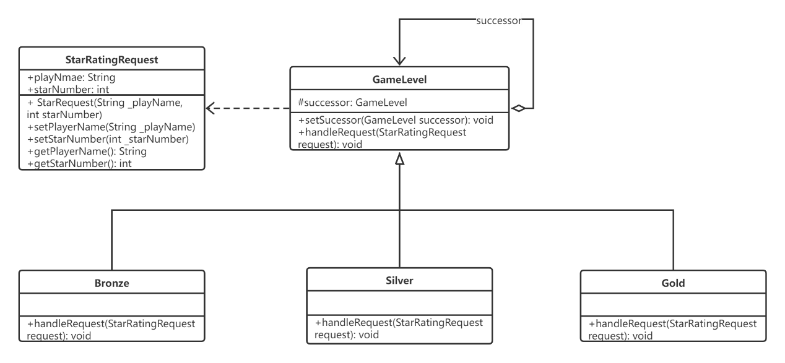
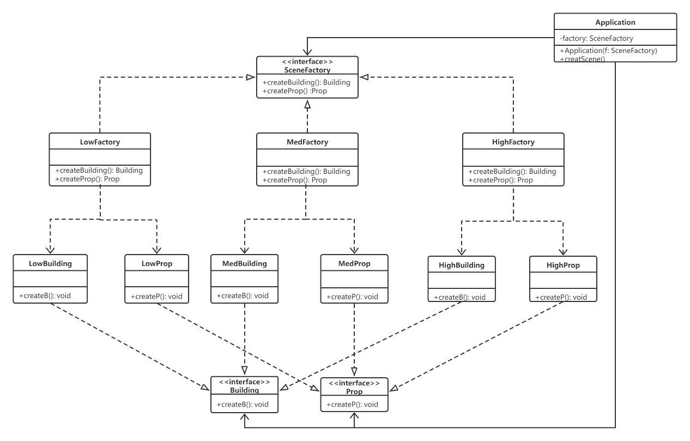
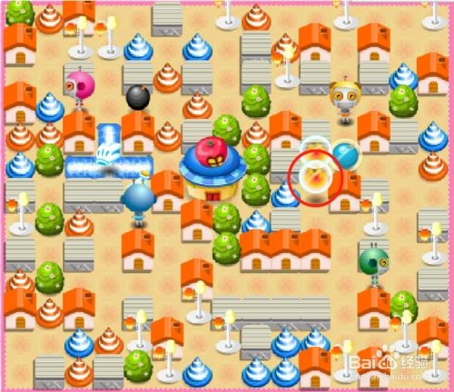
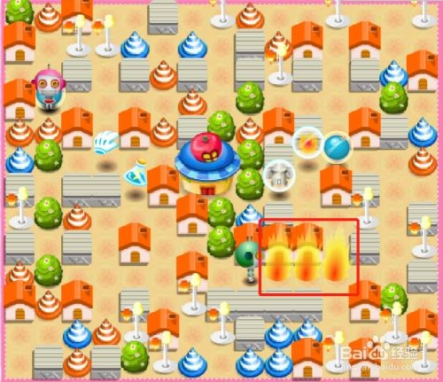
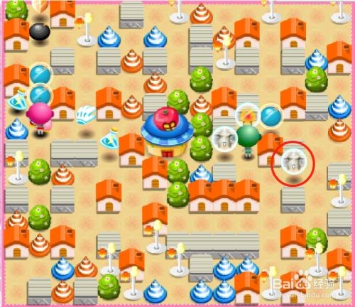
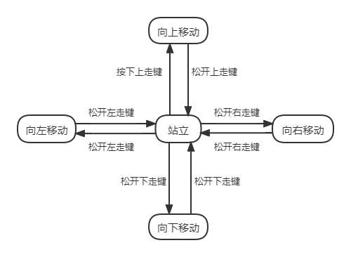
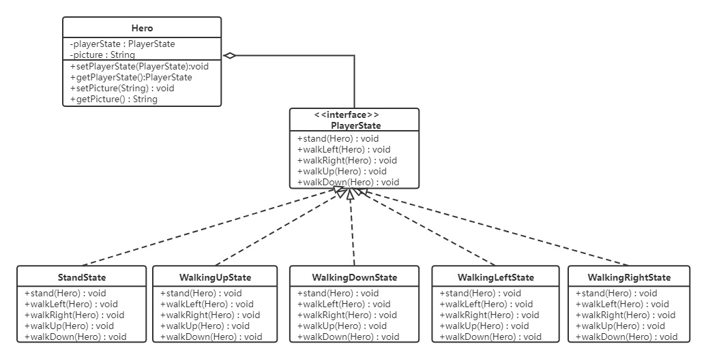

## 段位系统模块

炸弹人玩家段位等级设计，不同级别可以选择对应难度的关卡地图。
一共有3个段位，分别为青铜、白银、黄金。挑战模式中，每赢一局就能获得一颗星反之则失去一颗星。获得的星数与段位存在一种联系，当星数达到一定的程度，系统会匹配出相应的段位。玩家等级越高，可选择的关卡越多，同时难度也更大。不同级别难度下游戏地图可以产生不同类型的建筑及道具。

在很多情况下，可以处理某个请求的对象不止一个。很多对象都可以处理申请，而且它们构成一条链，请求沿着这条链传递，这条链就称为责任链。责任链可以是一条直线、一个环或者一个树形状，最常见的责任链是直线型，即沿着一条单向的链来传递请求。链上的每个对象都是请求处理者，责任链模式可以将请求的处理者组织成一条链，并使请求沿着链传递，由链上的处理者对请求进行相应的处理，客户端无须关心请求的处理细节以及请求的传递，只需将请求发送到链上即可。将请求的发送者和请求的处理者解耦，这就是责任链的模式动机在本游戏实例中，玩家等级星的数量先从青铜类评定，评定过了会传递给后面责任链，直到被处理。

职责链模式包含以下角色：
Handler(抽象处理者) 抽象处理者定义了一个处理请求的接口，它一般设计为抽象类，由于不同的具体处理者处理请求的方式不同，因此在其中定义了抽象请求处理方法。因为每个处理者的下家还是一个处理者，因此在抽象处理中定义了一个自类型(抽象处理者类型)的对象，作为其对下家的引用。通过该引用，处理者可以连为一条链。
Base Handler(基础处理者) 是一个可选的类，可以将所有处理者共用的样本代码放置在其中。通常情况下，该类中定义了一个保存对于下个处理者引用的成员变量。客户端可通过将处理者传递给上个处理者的构造函数或设定方法来创建链。该类还可以实现默认的处理行为：确定下个处理者存在后再将请求传递给它。
ConcreteHandler(具体处理类) 具体处理类是抽象处理类的子类，它可以处理用户请求，在具体处理者类中实现了抽象处理者中定义的抽象请求处理方法，在处理请求之前需要进行判断，看是否有对应的处理权限，如果可以处理请求就处理它，否则将请求转发给后继者；在具体处理类中可以访问链中下一个对象，以便请求转发。
Client(客户类) 客户类用于向链中的对象提出最初的请求，客户类只用关心链的源头，而无须关心请求的处理细节以及请求的传递过程。

在本例中，炸弹人三个段位：青铜，白银，黄金。星数量少于15，对应段位为青铜；星数量在15-35之间对应段位为白银；星数在35-55之间对应段位为黄金；多于55颗星，表示为黄金(X-55)星。

<center></img></center>
<center>图x</center>

### 创建请求类(StarRatingRequest)

```java
public class StarRatingRequest {
    private String playerName;
    private int starNumber;
    public StarRatingRequest(String _playerName, int _starNumber) {
        this.playerName = _playerName;
        this.starNumber = _starNumber;
    }
    public String getPlayerName() {
        return playerName;
    }
    public void setPlayerName(String playerName) {
        this.playerName = playerName;
    }
    public int getStarNumber() {
        return starNumber;
    }
    public void setStarNumber(int starNumber) {
        this.starNumber = starNumber;
    }
}
```

### 创建抽象处理者类(GameLevel)

```java
public abstract class GameLevel {
    //定义自类型 
    protected GameLevel successor;
    //接收下一家对象 
    public void setSuccessor(GameLevel successor) {
    this.successor = successor;
    }
    //抽象处理方法 
    public abstract void handleRequest(StarRatingRequest request);
}
```

### 创建具体处理者类(Bronze)

```java
public class Bronze extends GameLevel {
    /*
    * 创建具体处理者类
    * 当客户端传入的星数少于15，由该对象处理，否则传递给客户端指定的下家
    */
    @Override
    public void handleRequest(StarRatingRequest request) {
        if(request.getStarNumber() < 15) {
            System.out.println("玩家[" + request.getPlayerName() + "]统计为" 
            + request.getStarNumber() + "颗星，评定为等级：青铜");
        }else {
        if(this.successor != null) {
            this.successor.handleRequest(request);
        }
        }
    }
}
```

### 创建具体处理类(Silver)

```java
//创建具体处理者类
//当客户端传入的星数在15-35，由该对象处理，否则传递给客户端指定的下家
public class Silver extends GameLevel {
    @Override
    public void handleRequest(StarRatingRequest request) {
		if(request.getStarNumber() < 35) {
			System.out.println("玩家[" + request.getPlayerName() 
			+ "]统计为" + request.getStarNumber() + "颗星，评定为等级：白银");
		}else {
			if(this.successor != null) {
				this.successor.handleRequest(request);
			}
		}
	}
}

```

### 创建具体处理类(Gold)
```java
//创建具体处理者类
//当客户端传入的星数在35-55，由该对象处理，否则评定为王者段位
public class Royalty extends GameLevel {
	@Override
	public void handleRequest(StarRatingRequest request) {
		if(request.getStarNumber() < 55) {
			System.out.println("玩家[" + request.getPlayerName() + "统计为" 
					+ request.getStarNumber() + "颗星，评定为等级：黄金");
		}else {
			System.out.println("玩家[" + request.getPlayerName() 
			+ "]统计为" + request.getStarNumber() 
			+ "颗星，评定为等级：黄金" + (request.getStarNumber()-55) + "星");
		}
	}
}
```

## 地图元素生成模块

抽象工厂模式是工厂方法模式的泛化版，工厂方法模式是一种特殊的抽象工厂模式。在工厂方法模式中，每一个具体工厂只能生产一种具体产品，而在抽象工厂方法模式中，每一个具体工厂可以生产多个具体产品。在本实例中，高级别难度下生产的产品建筑和道具功能复杂，支持高段位等级的玩家挑战，低级别难度下生产的产品建筑和道具功能简单，支持低段位等级的玩家挑战。针对高、中、低分辨率的移动设备使用不同的显示资源和帧率。
抽象工厂模式涉及的角色有：
AbstractFactory(抽象工厂) 抽象工厂用于声明生成抽象产品的方法，在一个抽象工厂中可以定义一组方法，每一个方法对应一个产品等级结构。 
ConcreteFactory(具体工厂) 具体工厂实现了抽象工厂声明的生成抽象产品的方法，生成一组具体产品，这些产品构成了一个产品族，每一个产品都位于某个产品等级结构中。 
AbstractProduct(抽象产品) 抽象产品为每种产品声明接口，在抽象产品中定义了产品的抽象业务方法。 
ConcreteProduct(具体产品) 具体产品定义具体工厂生产的具体产品对象，实现抽象产品接口中定义的业务方法。

<center></img>
</center>
<center>图x</center>

### 创建抽象产品类Building
```java
public interface Building {
	public void createB();
}
```

### 创建抽象产品类Prop
```java
public interface PlayGame {
	public void createP();
}

```
### 创建具体产品类LowBuilding

```java
public class LowBuilding implements Building{
	public void createB ();
}
```
### 创建具体产品类LowProp
```java
public class LowProp implements Prop{
	public void createP () ;
}
```
### 创建具体产品类MedBuilding
```java
public class MedBuilding implements Building{
	public void createB () {
		
	}
}
```
### 创建具体产品类MedProp
```java
public class MedProp implements Prop{
	public void createP () {
		
	}
}
```

### 创建具体产品类HighBuilding

```java
public class HighBuilding implements Building{
	public void createB () {
		
	}
}
```
### 创建具体产品类HighProp
```java
public class HighProp implements Prop{
	public void createP () {
		
	}
}
```
### 创建抽象工厂类SceneFactory
```java
public interface SceneFactory {
	public Building createBuilding ();
	public Prop createProp ();
}
```
### 创建具体工厂类LowFactory

```java
public class LowFactory implements SceneFactory {
	public Building createBuilding () {
		return new LowBuilding ();
	}
	public Prop createProp () {
		return new LowProp ();
	}
}
```
### 创建具体工厂类MedFactory

```java
public class MedFactory implements SceneFactory {
	public Building createBuilding () {
		return new MedBuilding ();
	}
	public Prop createProp () {
		return new MedProp ();
	}
}
```
### 创建具体工厂类HighFactory

```java
public class HighFactory implements SceneFactory {
	public Building createBuilding () {
		return new HighBuilding ();
	}
	public Prop createProp () {
		return new HighProp ();
	}
}
```

## 物理攻击类道具模块

&emsp;&emsp;物理攻击类道具有火、冰和火箭三种。在吃掉物理攻击类道具后，会获得三次使用相应道具机会，但是不同的道具攻击策略和效果是不同的。
<center></img>
</img>
</center>
<center>图x</center>
&emsp;&emsp;例如，火道具如上图左所示。在玩家吃掉道具后，会获得三次喷火机会，每次火会在相应方向三个格施法，如上图右所示。受到火焰伤害的玩家会掉一点血。冰道具和火道具是完全相同的，只是道具形状和动画效果不同。
<center></img>
</center>
<center>图x</center>
&emsp;&emsp;火箭炮道具如上图所示。和火道具相比，火箭道具是发射一枚火箭，一直直线飞行直到碰撞到玩家或墙壁。受到火箭伤害的玩家会掉一点血。

&emsp;&emsp;从设计的角度，这三种道具只在使用策略上有所不同。对于玩家来说，只需要发出攻击指令，即可使用相应道具。可以使用策略模式，将将可变的部分从程序中抽象出来分离成算法接口，在该接口下分别封装一系列算法实现。
<center></img>
</center>
<center>图x</center>
&emsp;&emsp;该模块使用策略模式的类图如上图所示。抽象策略接口（Strategy）定义了一个公共接口，各种不同的算法以不同的方式实现这个接口；具体策略（Concrete Strategy）类实现了具体的冰、火、火箭的攻击策略，提供具体的算法实现；环境（Context）类是此处的Hero类，持有一个策略类的引用，最终给客户端调用。接口定义如下：

```java
public interface ISkill {
    void useSkill();
}
```

&emsp;&emsp;具体的策略（以火道具为例）类如下：

```java
public class FireSkill implements ISkill {
    @Override
    void useSkill()
    {
            //实现向指定方向距离为3的格子释放火焰
    }
}
```

&emsp;&emsp;玩家控制的角色继承自虚基类英雄Hero类，在里面对当前英雄道具（技能）进行设定。

```java
public abstract class Hero {
    //技能属性
    private ISkill iskill;
    //技能的setter
    public void setIskill(ISkill iskill) { this.iskill = iskill; }
    //技能使用
    public void attack() { iskill.useSkill(); }
}
```

&emsp;&emsp;这样就完成了采用策略模式对攻击行为进行多种方式的实现。后续如果采用更多的攻击方法，或者新增更多涉及物理攻击的道具，都可以继承自ISkill接口，易于扩展、理解和切换。同时具有更好的代码复用性，使用组合而不是继承让架构更加灵活。

## 人物行走模块

&emsp;&emsp;在玩家角色行走的过程中，对应有多种运动状态。
<center></img>
</center>
<center>图x</center>
&emsp;&emsp;以上图黄色人物为例，它对应了多种状态：，向下移动，向左移动，向右移动，站立。这个玩家在移动上对应不同的状态，而他的行为也取决于当前的状态，状态图如下图所示。
<center></img>
</center>
<center>图x</center>
&emsp;&emsp;可以看出，这个对象的行为取决于它当前的动作，例如初始状态下人物是向下站立状态，那么它可以向上下左右四个方向进行移动，对应的动画为头朝下。

&emsp;&emsp;类的设计如下图所示，五种状态（向上移动，向下移动，向左移动，向右移动，站立）实现了接口PlayerState类，在不同的状态下，执行的函数逻辑会有所不同。在Hero类中持有一个状态类变量playerState，记录当前的状态，picture变量用来记录当前的角色的动画画面为本地哪图片（分别对应头朝上、头朝下、头朝左、头朝右）。在需要修改状态的时候，需要将Hero的引用传入，实现状态的修改。
<center></img>
</center>
<center>图x</center>
&emsp;&emsp;此时Hero类的内容如下所示：

```java
public class Hero {
    //五种状态
    public static final PlayerState STAND = new StandState();
    public static final PlayerState WALKLEFT = new WalkingLeftState();
    public static final PlayerState WALKRIGHT = new WalkingRightState();
    public static final PlayerState WALKUP = new WalkingUpState();
    public static final PlayerState WALKDOWN = new WalkingDownState();
    
    //移动状态，初始为站立状态
    private PlayerState playerState = STAND;
    //对应头朝上、头朝下、头朝左、头朝右的图片路径
    private String picture;
    //状态的getter和setter
    public void setPlayerState(PlayerState playerState);
    public PlayerState getPlayerState();
    //图片路径的getter和setter
    public void setPicture(String file);
    public String getPicture();
}
```

&emsp;&emsp;PlayerState接口定义如下：

```java
public interface PlayerState
{
    void stand(Hero hero);
    void walkLeft(Hero hero);
    void walkRight(Hero hero);
    void walkUp(Hero hero);
    void walkDown(Hero hero);
}

```

&emsp;&emsp;具体的状态类，以向站立为例，如果键盘持续按下。

```java
public class StandState implements PlayerState{
    void stand(Hero hero)
    {
        //no nothing
    }
    void walkLeft(Hero hero)
    {
        if(keyboard press A)
        {
            hero.setPlayerState(Hero.STAND);
            hero.setPicture("/HeadLeft.jpg");
        }
    }
    void walkUp(Hero hero)
    {
        if(keyboard press W)
        {
            hero.setPlayerState(Hero.WALKUP);
            hero.setPicture("/HeadUp.jpg");
        }
    }
    void walkDown(Hero hero)
    {
        if(keyboard press S)
        {
            hero.setPlayerState(Hero.WALKDOWN);
            hero.setPicture("/HeadDown.jpg");
        }
    }
    void walkRight(Hero hero)
    {
        if(keyboard press D)
        {
            hero.setPlayerState(Hero.WALKRIGHT);
            hero.setPicture("/HeadRight.jpg");
        }
    }
}
```

&emsp;&emsp;这样就完成了行走状态的设计。采用状态模式将实现细节封装在各个不同的状态类中，状态转换交给状态类自己去实现，外部无需关心。去除了大量的判读逻辑，代码可读性更好了。今后也可以实现状态的新增，而无需对环境类（Hero）做出修改。

## Buff加成类道具模块

&emsp;&emsp;Buff加成类道具有护盾、加速鞋两种。在吃掉Buff加成类道具后，该玩家会获得相应的Buff加成效果。
<center></img>
</center>
<center>图x</center>
&emsp;&emsp;护盾道具如上图所示。在玩家吃掉道具后，会获得生命值加一点的加成。
<center></img>
</center>
<center>图x</center>
&emsp;&emsp;加速鞋道具如上图所示。在玩家吃掉道具后，会获得移动速度加一点的加成。

&emsp;&emsp;从游戏玩法上，这两种加成道具是可以动态的、可叠加的附加到玩家身上，因此可以使用装饰者模式，将玩家作为被装饰对象，加成道具作为装饰者，二者拥有相同的超类型，在玩家获取到加成道具时可以用装饰过的玩家替代当前玩家，达到获取加成的目的。

<center></img>
</center>
<center>图x</center>
&emsp;&emsp;该模块使用装饰者模式的类图如上图所示。虚基类英雄Hero类作为被装饰对象的超类，拥有health生命值和speed移动速度等属性；PlayerA等子类是动态的可叠加的加上Buff的装饰对象。

```java
public abstract class Hero {
    //生命值
    private int health=3;
    //移动速度
    private int speed=1;
    public int getHealth () { return this.health; }
    public int getSpeed () { return this.speed; }
    public abstract String info (){}
}
public class PlayerA extends Hero {
    public String info (){
        return “I am player A!”;
    }
}
```

&emsp;&emsp;装饰者BuffDecorator类也继承自Hero类，从而用装饰过的玩家替代当前玩家：

```java
public abstract class BuffDecorator extends Hero {
    public abstract String getDescption();
}
```

&emsp;&emsp;护盾装饰者DefendBuff类是一个具体装饰者，因此拓展自BuffDecorator类，同时它拥有一个被装饰者Hero类的引用，以便对其进行装饰并替代被装饰者。

```java
public class DefendBuff extends BuffDecorator {
    //被装饰者
    Hero hero;

    public DefendBuff (Hero hero) { 
    this.hero = hero; 
    }
    Public String getDescption(){
        return hero.info()+”buff:护盾+1”;
    }
    //进行buff加成
    Public int getHealth(){
        return hero.getHealth()+1;
    }
}
```

&emsp;&emsp;加速鞋装饰者AccelerateBuff类也是一个具体装饰者，因此也拓展自BuffDecorator类，同时它也拥有一个被装饰者Hero类的引用，以便对其进行装饰并替代被装饰者。

```java
public class AccelerateBuff extends BuffDecorator {
    //被装饰者
    Hero hero;

    public AccelerateBuff (Hero hero) { 
    this.hero = hero; 
    }
    Public String getDescption(){
        return hero.info()+”buff:移动速度+1”;
    }
    //进行buff加成
    Public int getSpeed(){
        return hero.getSpeed()+1;
    }
}
```

&emsp;&emsp;这样就完成了采用装饰者模式对Buff加成道具进行了实现，两种加成道具可以随时动态的、可叠加的加成到玩家身上。后续如果还有更多的加成道具，都可以继承自BuffDecorator装饰者基类，非常灵活且易于扩展。

## 玩家死亡处理

&emsp;&emsp;在游戏中当玩家生命值降到0时即会死亡，这时玩家的在地图上的所有状态包括身影都将移除出地图，因此当玩家改变状态为死亡时，地图都会收到通知并将该玩家移除出当前场景。为了让玩家和地图之间进行交互但同时维持松耦合，可以采用观察者模式，玩家作为被观察的对象，当玩家死亡后通知作为观察者的地图，地图再做出相应的去除玩家操作，观察者模式的类图如下所示：

<center></img>
</center>
<center>图x</center>
&emsp;&emsp;首先需要创建被观察者接口Subject和观察者接口Observer，其中Subject接口中含有观察者的注册和移除功能，还有变更发生后通知观察者的功能。而Observer接口中主要含有的是接收到变更后系统应该作出相应的更新的操作。

```java
public interface Subject {
    Public void registerObserver(Observer o);
    Public void removeObserver(Observer o);
    Public void notifyObservers();
    }
    public interface Observer {
    Public void update(Hero hero);
}
```

&emsp;&emsp;因为玩家是被观察的对象，因此玩家PlayerA类要实现Subject接口，并且在受到攻击死亡时会调用notifyObservers()通知观察者。

```java
public class PlayerA extends Hero implements Subject {
    private ArrayList observers;
    public PlayerA(){
        observers = new ArrayList();
    }
    //实现Subject接口
    Public void registerObserver(Observer o){
        observers.add(o);
    }
    Public void removeObserver(Observer o){
        int i = observers.indexOf(o);
    if(i>=0) observers.remove(i);
    }
    Public void notifyObservers(){
        For(int i=0;i<observers.size();i++){
            Observer observer=(Observer)observer.get(i);
            Observer.update(this);
        }
    }
    //当玩家受到攻击后生命值等于0时死亡，将通知观察者
    public void attacked(){
        this.health-=1;
        if(this.health<=0)
            notifyObservers();
    }
}
```

&emsp;&emsp;因为地图是需要在接收到玩家死亡的通知后进行更新的，因此它需要实现Observer接口以从被观察者对象中获得改变并作出相应的更新。并且地图需要被观察者的引用作为注册观察者之用。

```java
public class PlayMap implements Observer{
    private Subject PlayerA;
    public PlayMap(Subject playerA){
        this.PlayerA=playerA;
        playerA.registerObserver(this);
    }
    Public void update(Hero hero){
        changeMap(hero);
    }
    //做出相应的更新
    Public void changeMap(Hero hero){
        //将该玩家移除出当前地图
        deleteHeroFromMap(hero);
    }
}
```

&emsp;&emsp;这样就完成了采用观察者模式对玩家死亡后地图及时更新的实现，具体而言，初始时玩家会注册地图成为自己的观察者，之后当玩家受到攻击并死亡时会通知其观察者即地图，，地图随之做出更新将该玩家移除出当前地图。这种设计使得被观察者（玩家）不需要知道具体的观察者（地图）是谁、做了什么或其他任何细节，两者之间是松耦合的，并且任何时候都可以增加新的观察者或者移除观察者，而被观察者不会受到任何影响，从而建立能应对变化的OO系统。
